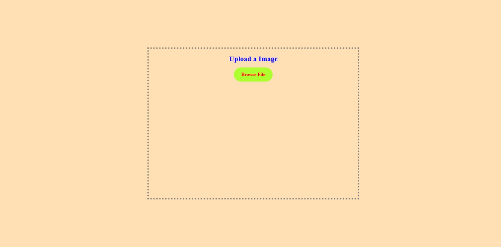

# 🖼️ Image Upload Preview Project

This is a simple Image Upload Preview project using HTML, CSS, and JavaScript.  
Users can upload an image, preview it instantly, and close the preview if needed.

---

## 🔗 Live Demo

👉 [View Live Project Here](https://msdhinesh45.github.io/Image-uploader)

---

## 🎯 Features

- Upload and preview image instantly
- Close the uploaded image preview
- Clean and user-friendly interface
- Simple toggle effect for upload and close actions

---

## 🖼️ Output Screenshots

### 🖼️ Image Upload Page

### 🖼️ After Uploading an Image

---

## 💻 Tech Stack Used

- HTML5
- CSS3
- JavaScript

---

## 📜 How It Works

- Click the "Browse File" button to choose an image.
- The selected image will preview instantly on the page.
- Click the close (✖️) icon to remove the preview.

---

## 🙋‍♂️ Author

**Dhinesh Kumar**  
🔗 [GitHub Profile](https://github.com/msdhinesh45)

---

## 📃 License

This project is free to use for learning and personal projects.

---
